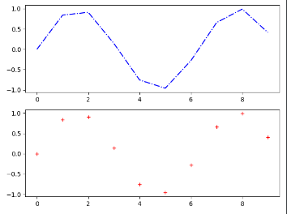

# 线图


- 同时设置[fmt]参数和关键字参数时，以关键字参数为准

##1、 调用plot方法绘制点和线图
- plot([x],y,[fmt],data=None,**kwargs)
- plot([x],y,[fmt],[x2],y2,[fmt2],...,**kwargs)
- x,y为点和线坐标
- [fmt]为多个字符串的组合，用来设置点或线的颜色和线条样式。
```py
plt.figure(1)
plt.subplot(211)
plt.plot(np.sin(np.arange(0, 10)), 'b-.')
plt.subplot(212)
plt.plot(np.sin(np.arange(0, 10)), 'r+')
```


### [fmt]组成
- color、marker（点的类型）、line（线条风格）
```py
fmt = '[color][marker][line]'
```
- fmt若由多部分组成从以下表中选取，若只有颜色，可以用十六进制表示#00FF00
[颜色参考跳转](https://www.w3school.com.cn/tags/html_ref_colornames.asp)
- **color**

|字符|颜色|字符|颜色|
| :-: | :-: | :-: | :-: |
| 'b' | 蓝色 | 'm' |洋红色|
| 'g' | 绿色| 'y' |黄色|
| 'r' | 红色| 'k' |黑色|
| 'c' | 青色| 'w' |白色|

- **marker**

|字符|描述|字符|描述|
| :-: | :-: | :-: | :-: |
| '.' | 点标记 | 's' |方形标记|
| ',' | 像素标记| 'p' |五边形标记|
| 'o' | 圆圈标记| '*' |明星标记|
| 'v' | triangle_down标记| 'h' |hexagon1标记|
| '^' |triangle_up标记 | 'H' |hexagon2标记|
| '<' | triangle_left标记| '+' |加上标记|
| '>' | triangle_right标记| 'x' |x标记|
| '1' | tri_down标记| 'D' |钻石标记|
| '2' | tri_up标记| 'd' |thin_diamond标记|
| '3' | tri_left标记| \'\|' |vline标记|
| '4' | tri_right标记| '_' |hline标记|

- **line**

|字符|描述|
| :-: | :-: |
| '-' | 实线样式 |
| '--' | 虚线样式| 
| '-.' | 点划线样式|
| ':' | 虚线样式|

## 2、Line2D（设置关键字参数）
- plot(data,'go--',linewidth=2,markersize=12)
- plot(data,'color='green',marker='o',linestyle='dashed',markersize=12)