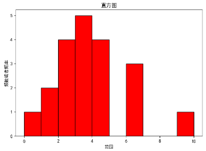

# 直方图

- **bins**：图中条形的个数
- **color**：条形颜色
- **edgecolor**：条形边缘颜色
- **alpha**：条形透明度
- 每一个条形表示在整体样本中出现的次数，即频率或频数
```py
plt.rcParams["font.sans-serif"] = ["SimHei"]

data = np.array([0, 1, 1, 2, 2,
                 2, 2, 3, 3, 3,
                 3, 3, 4, 4, 4,
                 4, 6, 6, 6, 10])
plt.hist(data, bins=10, color="red", edgecolor="black", alpha=1)
plt.xlabel("范围")
plt.ylabel("频数或者频率")
plt.title("直方图")
plt.show()
```
