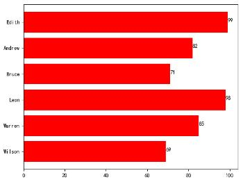
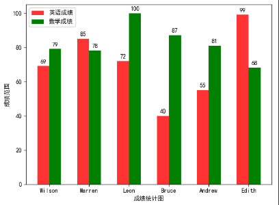

# 条形图

### 水平条形图
```py
plt.rcParams["font.sans-serif"] = ["SimHei"]

names = ["Wilson", "Warren", "Leon", "Bruce", "Andrew", "Edith"]
score = [69, 85, 98, 71, 82, 99]

plt.barh(range(6), score, color="red")  # 传入每位同学的成绩 
plt.yticks(range(6), names)  # 作为y轴上的刻度

for i in range(6):  # x轴范围根据score自动生成
    plt.text(score[i], i, score[i])

plt.show()
```


### 垂直条形图
```py
names = ["Wilson", "Warren", "Leon", "Bruce", "Andrew", "Edith"]
en_score = [69, 85, 72, 40, 55, 99]
math_score = [79, 78, 100, 87, 81, 68]

en_bar = plt.bar(range(6), height=en_score, width=0.3, alpha=0.8, color="red", label="英语成绩")
math_bar = plt.bar([i + 0.3 for i in range(6)], height=math_score, width=0.3, color="green", label="数学成绩")

plt.xticks([i + 0.15 for i in range(6)], names)
plt.xlabel("成绩统计图")

plt.legend()
plt.ylabel("成绩范围")

for en in en_bar:
    height = en.get_height()
    plt.text(en.get_x() + en.get_width() / 2, height + 1, str(height), ha="center", va="bottom")
for math in math_bar:
    height = math.get_height()
    plt.text(math.get_x() + math.get_width() / 2, height + 1, str(height), ha="center", va="bottom")

plt.show()
```
