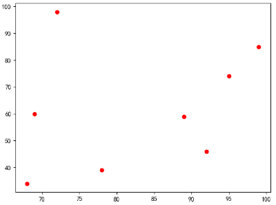

# 散点图

```py
plt.rcParams["font.sans-serif"] = ["SimHei"]

data_x = np.array([92, 68, 78, 69, 95, 99, 89, 72])
data_y = np.array([46, 34, 39, 60, 74, 85, 59, 98])
plt.figure(1)
plt.scatter(data_x, data_y, marker="o", c="r")
plt.show()
```

