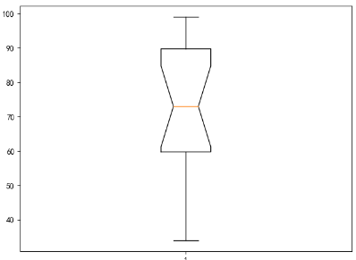
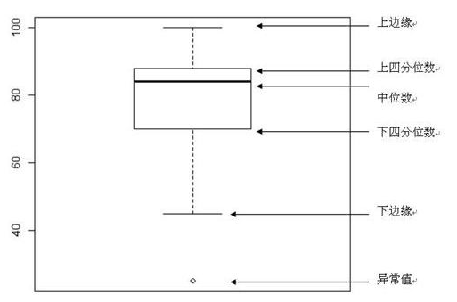

# 箱线图

```py
plt.rcParams["font.sans-serif"] = ["SimHei"]

data = np.array([92, 68, 78, 69, 95, 99, 89, 72,
                 46, 34, 39, 60, 74, 85, 59, 98])
plt.boxplot(data, meanline=True, notch=True)
plt.show()
```


