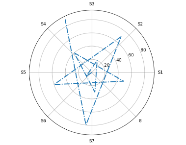

# 极坐标图

```py
data = np.arange(0, 100, 10)
print(data)
ax = plt.subplot(111, projection="polar")  # 创建极坐标系
ax.set_xticklabels(["S1", "S2", "S3", "S4",  "S5", "S6", "S7", "8"])  # 设置极坐标的刻度
ax.plot(data, data, "-.", lw=2)
plt.show()
```

