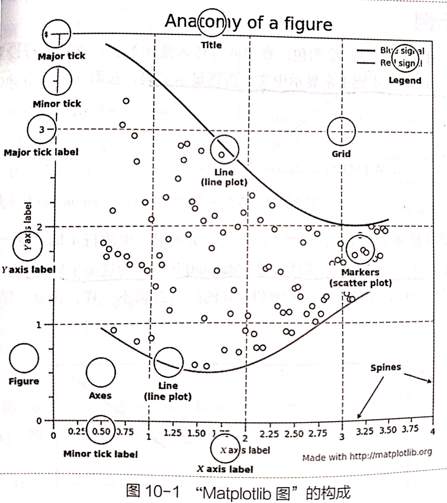

> 此为Matplotlib学习笔记

 [View Note]()

[Matplotlib官方网站](https://matplotlib.org/)

# 目录

- [01_创建数组](./01_创建数组.html)
- [02_数据调整](./02_数据调整.html)
- [03_索引_切片_迭代](03_索引_切片_迭代.html)
- [04_副本_浅拷贝_深拷贝](04_副本_浅拷贝_深拷贝.html)
- [05_基本运算](./05_基本运算.html)
- [06_统计_排序](./06_统计_排序.html)

# Matplotlib
- **安装Matplotlib**
```py
pip install matplotlib
```

- **导入**
```py
import matplotlib.pyplot as plt
```



## 基本要素
- **Figure**：创建画布，设置画布大小，将画布划分多个区域。
```py
plt.figure(1, figsize=(10, 5))
```
- **Axes**：画布上的轴，表示维数。
- **Axis**：每个轴的数据范围及刻度线,[xmin,xmax,ymin,ymax]
```py
plt.axis([0, 10, 2, 12]) 
```
- **Artist**：图上标题、图例、文本等。

## 导入数据
- **通过x/y轴**
```py
data_x = [1, 2, 3, 4, 5]
data_y = [6, 7, 8, 9, 10]
plt.plot(data_x, data_y)
```
- **通过Numpy数组**
```py
data_x = np.array([1, 2, 3, 4, 5])
data_y = np.array([3, 5, 4, 7, 10])
plt.plot(data_x * 2, data_y, 'r--', data_x * 3, data_y, 'bs') 
```
- **通过关键字**
- scatter第一个参数表示0x轴，第二个参数为y轴
```py
data = {
        "a": np.arange(20),
        "b": np.random.randint(0, 20, 20)
}
plt.scatter("a", "b", data=data)
```

- **通过分组绘图**
```py
group_name = ["A", "B", "C", "D", "E"]  # 组的名称
values = [1, 20, 30, 40, 50]  # 各组对应的值

plt.figure(1, figsize=(10, 5))

plt.subplot(131)
plt.bar(group_name, values)
```


## 添加文本
- **添加y/x轴标签**
```py
plt.xlabel("x轴")
plt.ylabel("y轴")
```
- **添加标题**
```py
plt.title("线性图", fontproperties="SimHei")
plt.suptitle("分组绘制", fontproperties="SimHei")
```
- **指定位置位置添加文本**
```py
plt.text(2, 15, r"数据走势", color="green", fontproperties="SimHei")  # 在（2，15）位置添加文本
```
- **添加注释**：
```py
plt.annotate("中间值", xy=(12.5, 12.5), xytext=(15, 10), fontproperties="SimHei",
             arrowprops=dict(facecolor='black', shrink=0.05))
# xy表示箭头作标位置，xytext表示线段的起始位置，arrowprops线段的样式（颜色、粗细）
```

## 线条样式布局

- **图形样式**：
```py
plt.plot(data_x, data_y, 'ro') # 点
plt.plot(data_x * 2, data_y, 'r--', data_x * 3, data_y, 'bs') # 虚线、方块
```
- **线条属性**
> plt.setp(lines) 获取所有可设置的属性列表
```py
lines = plt.plot([1, 2, 3, 4], [1, 4, 9, 16],
                 [1, 2, 3, 4] * 2, [1, 4, 9, 16] * 2)
plt.axis([0, 6, 0, 20])
lines[0].set_antialiased(False) # 调用实例的方法设置第一条线样式
plt.setp(lines, "color", "r", "linewidth", 2.0) # 同时设置两条线的样式红色，宽度为2.0英寸
```

- **画布与子图**
```py
plt.figure(1)  # 创建第1张画布，参数为画布编号
plt.subplot(211)  # 211：2，1，1。画布分为2行1列，在第1个子图区域绘图
plt.plot([1, 2, 3])
plt.subplot(212)  # 212：2，1，2。画布分为2行1列，在第2个子图区域绘图
line = plt.plot([4, 5, 6])

plt.figure(2)  # 创建第2张画布
plt.plot([4, 5, 6])
plt.show()

plt.figure(1)  # 放在第1张画布内
plt.subplot(212)
plt.title("第1张画布的第2个子图", fontproperties="SimHei")
```

## 设置样式
> print(plt.style.available)  获取样式表
- **样式表**
-  - plt.style.use中的样式在程序执行的过程中生效。
```py
plt.style.use("fivethirtyeight")
data = np.random.randn(50)
plt.plot(data)
plt.show()
```
-  - 使用多种样式
```py
plt.style.use(['fivethirtyeight', 'dark_background'])
```
- **临时引入样式**
- - 一个程序绘制多个图，每个图用不同样式时引入临时样式
```py
with plt.style.context(("dark_background")):
    data = np.linspace(0, 3 * np.pi)
    plt.plot(np.sin(data), "r-o")
    plt.show()
```
- **rc参数动态修改图形样式**
> SymPy是Python的科学计算库，可以完成多项式求值、求极限、解方程、求积分、微分方程、级数展开、矩阵运算等等计算问题。
[ SymPy详细学习](https://www.jianshu.com/p/339c91ae9f41)
```py
from sympy.physics.quantum.tests.test_circuitplot import mpl

mpl.rcParams['lines.linewidth'] = 2
mpl.rcParams['lines.color'] = 'r'
plt.plot(np.sin(np.arange(0, 10)), 'b-.')
```


