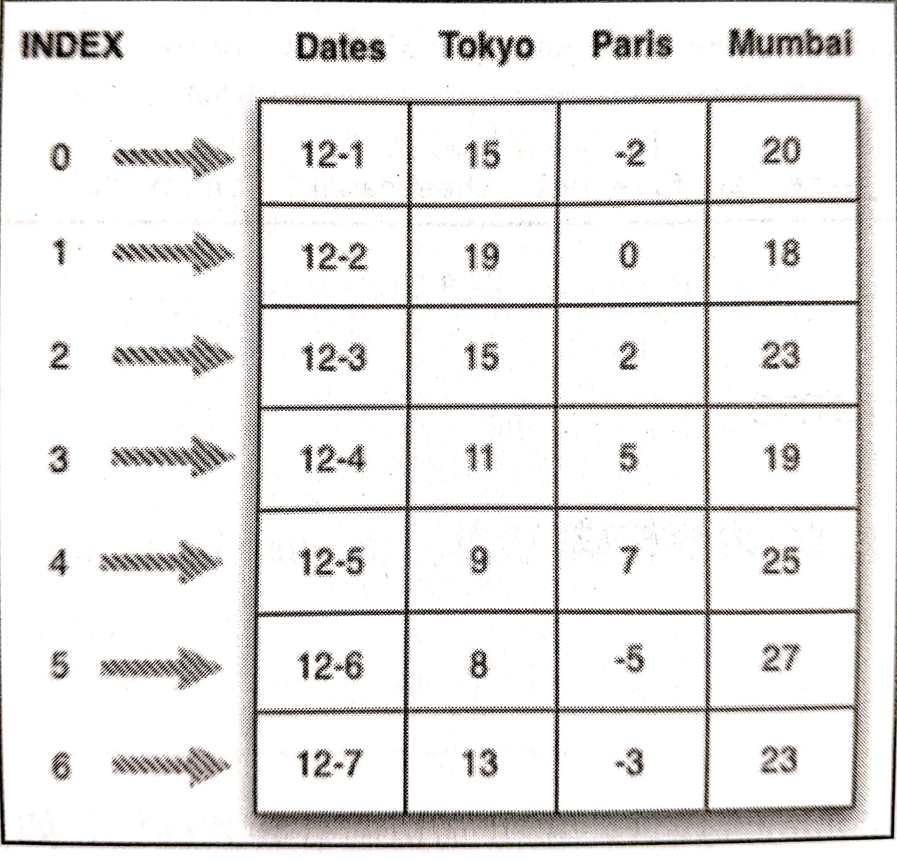

# 数据帧
- 数据以行和列的表格方式排列,索引、列名、数字

- **参数**：
   - **data**:创建数据帧对象的原始数据，可为字典、序列、其他数据帧
   - **inde**x：索引
   -  **columns**：一个数组，包含列名称
   -  **dtype**：序列中数据类型
   -  **copy**：是否创建数据副本

#### 1、创建空白数据帧
```py
df = pd.DataFrame()
print(df)
```

####  2、通过列表创建数据帧
- 含字典的列表：每个key值为一列，列名：key值
- 普通字符串：每个数组为一列，列明：默认0。一维：一列。
```py
data = [{"name": "Wilson", "age": 15, "gender": "man"},
        {"name": "Ivy", "age": 25, "gender": "woman"}]
df = pd.DataFrame(data)
 #    name   age gender
# 0  Wilson   15    man
# 1     Ivy   25  woman

data = ["Wilson", "Ivy"]
df = pd.DataFrame(data)
#        0
# 0  Wilson
# 1     Ivy
df = pd.DataFrame(data, columns=["name"]) # 修改列名
```

#### 3、通过字典创建数据帧
- key表示列，后面数组表示行
```py
data = {
        "name": ["Wilson", "Bruce", 
        "Chelsea"], "age": [15, 24, 19], 
        "gender": ["man", "man", "woman"]
}
df = pd.DataFrame(data)
#       name  age gender
# 0   Wilson   15    man
# 1    Bruce   24    man
# 2  Chelsea   19  woman
```

#### 4、通过序列创建数据帧
- 将**行的值创建为一个序列**，将多个序列组合成字典，通过字典创建数据帧。
```py
series = {"name": pd.Series(["Wilson", "Bruce", "Chelsea"]),
          "age": pd.Series([15, 24, 19]),
          "gender": pd.Series(["man", "man", "woman"])}

df = pd.DataFrame(series)
#       name  age gender
# 0   Wilson   15    man
# 1    Bruce   24    man
# 2  Chelsea   19  woman
```
